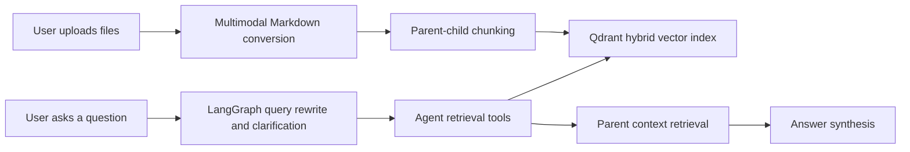

# Multimodal Agentic RAG

A local-first multimodal RAG application that ingests PDFs, images, spreadsheets, Office documents, and Markdown files into a searchable knowledge base, then answers questions through a LangGraph-powered agent.

The project extends a classic text-only RAG pipeline into a multimodal document intelligence system. Every supported source is converted into Markdown first, then indexed through the existing parent-child chunking and hybrid Qdrant retrieval flow.

## What It Does

- Upload PDFs, images, CSV/TSV files, Excel workbooks, DOCX, PPTX, HTML, TXT, and Markdown.
- Convert multimodal inputs into Markdown using open-source parsing/OCR/captioning tools.
- Split documents into parent and child chunks for better retrieval precision and answer context.
- Store child chunks in Qdrant with hybrid dense + sparse retrieval.
- Retrieve evidence with LangGraph tool calls before answering.
- Preserve conversation memory, clarify ambiguous questions, and aggregate multi-step answers.
- Provide a Gradio UI for document management and chat.

## Multimodal Ingestion

| Capability | Open-source component | Purpose |
| --- | --- | --- |
| Document parsing | Docling | Convert rich documents such as PDF, DOCX, PPTX, and HTML into Markdown |
| OCR | PaddleOCR | Extract visible text from uploaded images |
| Image captioning | Hugging Face Transformers + BLIP | Generate searchable visual descriptions for images |
| Table extraction | Camelot | Extract tables from PDFs |
| Spreadsheet parsing | pandas, openpyxl, xlrd | Convert CSV/TSV/Excel tables into Markdown tables |

Supported upload formats:

`.pdf`, `.md`, `.txt`, `.png`, `.jpg`, `.jpeg`, `.webp`, `.bmp`, `.tif`, `.tiff`, `.csv`, `.tsv`, `.xlsx`, `.xls`, `.docx`, `.pptx`, `.html`, `.htm`

## Architecture



The ingestion layer is intentionally thin: it converts each supported file type into Markdown and then reuses the original RAG pipeline. This keeps the project modular and makes future parsers easy to add without rewriting the agent or vector database logic.

## Project Structure

```text
project/
  app.py                         # Gradio app entry point
  config.py                      # Central model, retrieval, and ingestion config
  document_chunker.py            # Parent-child chunking
  core/
    document_manager.py          # Upload, conversion, chunking, indexing
    multimodal_processor.py      # Image/table/document to Markdown adapters
    rag_system.py                # Qdrant, LLM, tools, graph bootstrap
    chat_interface.py            # Streaming chat adapter
    observability.py             # Optional Langfuse integration
  db/
    vector_db_manager.py         # Qdrant hybrid retrieval setup
    parent_store_manager.py      # Parent chunk storage
  rag_agent/
    graph.py                     # LangGraph workflow
    nodes.py                     # Query rewrite, retrieval, compression, aggregation
    tools.py                     # search_child_chunks and retrieve_parent_chunks
  ui/
    gradio_app.py                # Document upload and chat UI
```

## Quick Start

### 1. Create an environment

```bash
python3 -m venv .venv
source .venv/bin/activate
python -m pip install --upgrade pip
python -m pip install -r requirements.txt
```

### 2. Install and run Ollama

Install Ollama from [ollama.com](https://ollama.com), then pull the default chat model:

```bash
ollama pull granite4.1:8b
```

The default embedding model is `Qwen/Qwen3-Embedding-0.6B`. It will be downloaded by Hugging Face tooling on first use.

### 3. Launch the app

```bash
python project/app.py
```

Open the local Gradio URL, upload files in the Documents tab, then ask questions in the Chat tab.

## Configuration

Main settings live in [project/config.py](project/config.py).

```python
DENSE_MODEL = "Qwen/Qwen3-Embedding-0.6B"
SPARSE_MODEL = "Qdrant/bm25"
LLM_MODEL = "granite4.1:8b"
RETRIEVAL_SCORE_THRESHOLD = 0.4
DEFAULT_RETRIEVAL_K = 7

IMAGE_CAPTION_MODEL = "Salesforce/blip-image-captioning-base"
PADDLEOCR_LANG = "ch"
TABLE_ROWS_PER_MARKDOWN_BLOCK = 200
```

Runtime data is intentionally ignored by Git:

- `qdrant_db/`
- `markdown_docs/`
- `parent_store/`
- `.env`
- `.venv/`

## Notes on First Run

The first upload for some formats may take longer because model weights or parser assets need to initialize:

- image captioning initializes a BLIP model through Transformers
- OCR initializes PaddleOCR
- document parsing initializes Docling
- PDF table extraction initializes Camelot

After conversion, all content is stored as Markdown and indexed through the same RAG pipeline.

## Validation

Lightweight checks used during development:

```bash
python3 -m compileall -q project
```

The multimodal conversion layer was also smoke-tested with CSV and image inputs to verify Markdown generation before indexing.

## Resume Highlights

- Built a multimodal RAG ingestion layer for PDFs, images, tables, spreadsheets, and Office documents.
- Integrated high-star open-source models/tools including Docling, PaddleOCR, Transformers/BLIP, Camelot, Qdrant, and LangGraph.
- Preserved a modular RAG architecture by normalizing all source formats into Markdown before chunking and indexing.
- Implemented agentic retrieval with query rewriting, clarification, tool-based search, context compression, and final answer aggregation.

## License

This project keeps the original repository license. See [LICENSE](LICENSE).
