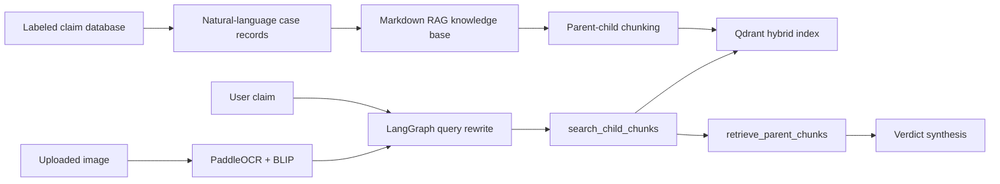

<h1 align="center">RumerDetection-rag</h1>

<p align="center">
  <strong>Agentic RAG system for Chinese text and image rumor detection</strong>
  <br />
  <em>OCR + BLIP image parsing · Natural-language case database · Qdrant hybrid retrieval · LangGraph agent</em>
</p>

<p align="center">
  <a href="README.md">English</a> ·
  <a href="README.zh-CN.md">简体中文</a>
</p>

<p align="center">
  
  
  
  
</p>

---

RumerDetection-rag is a retrieval-augmented rumor detection application for Chinese text and image claims. It stores labeled rumor cases as searchable natural-language judgments, retrieves similar cases for a new input, and uses an agent workflow to produce a grounded verdict.

The system is designed for evidence-first answers: if similar cases are missing or weak, the assistant returns `证据不足` instead of forcing a binary classification.

## Core Features

| Feature | Description |
| --- | --- |
| Text and image detection | Accepts direct text input or uploaded images in the chat UI |
| OCR + BLIP parsing | Uses PaddleOCR for image text extraction and BLIP for image captioning |
| Natural case database | Stores each case as a readable judgment such as `喝汤比吃菜更有营养是谣言` |
| Label mapping | Keeps the explicit labels `1 = 谣言` and `0 = 非谣言` |
| Hybrid retrieval | Uses Qdrant dense + sparse retrieval to find similar labeled claims |
| Agentic workflow | Uses LangGraph for query rewriting, retrieval tools, context compression, and synthesis |
| Evidence-grounded verdict | Returns `谣言`, `非谣言`, or `证据不足` with supporting retrieved cases |

## Knowledge Base

The main retrieval database is stored in `data/rumor_database.csv`.

Example format:

```csv
id,statement,label,label_name
RD-00001,喝汤比吃菜更有营养是谣言,1,谣言
RD-02687,年轻人同样可能感染并传播病毒不是谣言,0,非谣言
```

Current database statistics:

| Label | Meaning | Rows |
| --- | --- | ---: |
| 1 | 谣言 | 1844 |
| 0 | 非谣言 | 1513 |
| total | - | 3357 |

## Architecture



## Quick Start

### 1. Install Dependencies

```bash
python3 -m venv .venv
source .venv/bin/activate
python -m pip install --upgrade pip
python -m pip install paddlepaddle==3.0.0 -i https://www.paddlepaddle.org.cn/packages/stable/cpu/
python -m pip install -r requirements.txt
```

The CPU PaddlePaddle command above enables PaddleOCR on common local environments. For GPU or platform-specific wheels, follow the [PaddleOCR installation guide](https://paddlepaddle.github.io/PaddleOCR/v3.1.1/en/quick_start.html).

### 2. Prepare Ollama

Install Ollama from [ollama.com](https://ollama.com), then pull the default chat model:

```bash
ollama pull granite4.1:8b
```

The default embedding model is `Qwen/Qwen3-Embedding-0.6B`.

### 3. Launch the App

```bash
python project/app.py
```

Open the Gradio URL, click **Build / Rebuild Rumor RAG Database**, then enter a claim or upload an image in the Chat tab.

## Evaluation

Run a lightweight QA evaluation:

```bash
python project/evaluation.py \
  --qa project/evaluation_sample.json \
  --output rag_evaluation_results.csv
```

The evaluator rebuilds the RAG database, runs the LangGraph agent, and exports the predicted verdict, final answer, deterministic sources, retrieved context count, reference-overlap proxy score, and expected-source hit rate.

## Project Structure

```text
data/
  rumor_database.csv
project/
  app.py
  config.py
  rumor_database.py
  document_chunker.py
  core/
    document_manager.py
    image_claim_extractor.py
    rag_system.py
    chat_interface.py
  db/
    vector_db_manager.py
    parent_store_manager.py
  rag_agent/
    graph.py
    nodes.py
    tools.py
    prompts.py
  ui/
    gradio_app.py
```

## Validation

```bash
python3 -m compileall -q project
python3 project/evaluation.py --help
python3 -m json.tool project/evaluation_sample.json
```

## Notes

- The assistant uses retrieved cases as evidence rather than relying on a trained classifier alone.
- Image inputs are parsed before retrieval. OCR text is the primary signal, and BLIP captions are secondary context.
- The first image request may download OCR and BLIP model weights.
- The response starts with `判定：谣言`, `判定：非谣言`, or `判定：证据不足`.
- The system is an evidence-grounded aid, not a general medical or legal authority.

## License

See [LICENSE](LICENSE).
